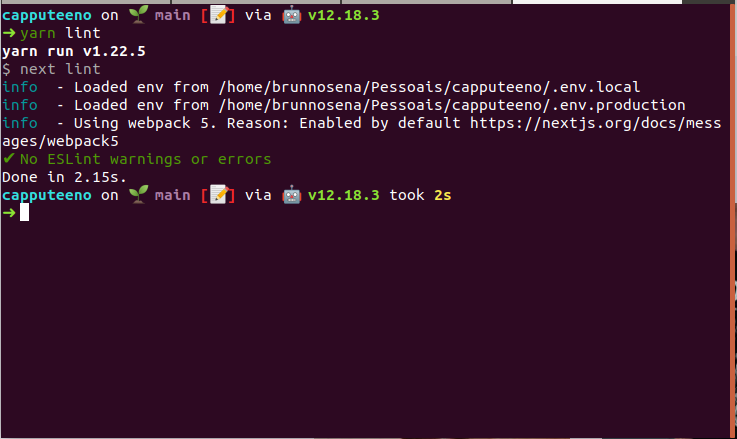
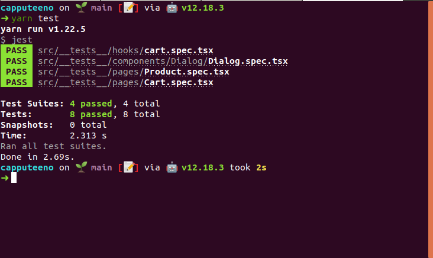

<div align="center">
  <h3 align="center">Challenge Boosting People</h3>
   
</div>

## Sobre o Projeto

O projeto é implementar um e-commerce para venda de canecas e camisetas que devem ter a seguintes funcionalidades.

- [x] Catálogo de produtos com paginação
- [x] Filtragem produtos por categoria
- [x] Busca por nome do produto
- [x] Adicionar e remover produtos do carrinho
- [x] Finalizar compra

## Layout

- Seguindo [esse protótipo](https://www.figma.com/file/rET9F2CeUEJdiVN7JRu993/E-commerce---capputeeno?node-id=680%3A6449)

## ✨ Technologies

- [NextJs](https://pt-br.reactjs.org/)
- [ReactJS](https://reactjs.org/)
- [Typescript](https://www.typescriptlang.org/)
- [Styled-Components](https://styled-components.com/)
- [GraphQl](https://graphql.org/)
- [@apollo/client](https://www.apollographql.com/docs/react/)
- [ESLint](https://eslint.org/)
- [Jest](https://jestjs.io/pt-BR/)
- [@testing-library/react](https://testing-library.com/)

---

### Utilização

Faça um clone do repositório:
```sh
git clone https://github.com/brunnosena/capputeeno-shopping
```

- [Backend]
No projeto há uma pasta `api` com o código da API que será 
utilizada no projeto. 
Entre na pasta "api" do projeto e rode o comando `yarn` para instalar as dependências, após isto basta rodar `yarn start` para iniciar. 
Ele será iniciado no endereço `http://127.0.0.1:3333`.

- [Frontend]

Entrar na pasta raiz e rodar o comando `yarn` para instalar as dependências, após isto adicione um arquivo ".env" na raiz do projeto, NEXT_PUBLIC_API_URL= (http://127.0.0.1:3333 **ou utilizar a api disponibilizada https://rocketseat-frontend-challenge.herokuapp.com** rodar `yarn dev` para iniciar o front.

---

### Testes unitários

Criado testes unitários de componente, screens e hooks.

Para rodar o teste:

```sh
yarn jest
```




---

### Deploy na vercel

[](https://capputeeno.brunnosena.vercel.app/)

---

<div align="center">
  <h1>Open Source</h1>
  <sub>Copyright © 2021-present, brunnosena.</sub>
  <p>capputeeno <a href="https://github.com/brunnosena/capputeeno-shopping/tree/dev/LICENSE">is MIT licensed 💖</a></p>
  
</div>